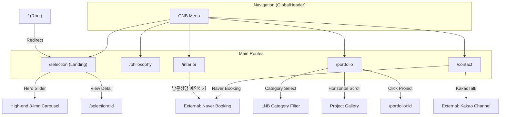

# Frontend Architecture v3.0 (Vue3 + Vite + TypeScript — High-end Editorial Magazine)

> **v4.0 핵심 변경:** 하이엔드 에디토리얼 매거진 스타일 유지 + 다중 뷰 라우팅 전환.
> - 기존 햄버거 메뉴 및 스크롤 스냅 폐지 → **글로벌 헤더 (GlobalHeader)** 도입.
> - 중앙 로고 + GNB (Philosophy, Portfolio, Selection, Contact).
> - 초기 랜딩: `/selection` 라우트.

---

## 1. 구조 설계 원칙
- **상태 최적화:** Pinia — 권한(Auth) 전역 상태 관리.
- **HTTP 클라이언트 모듈화:** Axios Interceptor 기반 에러 일원화.
- **코드 스플리팅:** Vue Router 비동기 로드 + 컴포넌트 Lazy Loading.

---

## 2. 디렉토리 구조

```text
/frontend
├── index.html              # OG / SEO 메타 태그
├── vite.config.ts          # Vite 설정
├── tailwind.config.js      # Design Token
├── src/
│   ├── main.ts             # App 엔트리
│   ├── router/
│   │   └── index.ts        # 라우트 정의
│   ├── store/              # Pinia Stores
│   │   ├── auth.ts
│   │   └── cart.ts
│   ├── services/           # API 클라이언트
│   │   ├── api.ts
│   │   ├── product.service.ts
│   │   └── auth.service.ts
│   ├── composables/
│   │   ├── useAuth.ts
│   │   ├── useToast.ts
│   │   ├── usePagination.ts
│   │   └── useActiveSection.ts  # 스크롤 스냅 섹션 감지
│   ├── views/
│   │   ├── HomeView.vue         # 원페이지 랜딩 (5 Sections)
│   │   ├── products/
│   │   └── admin/
│   ├── layouts/
│   │   ├── LandingLayout.vue    # 랜딩 전용 (HamburgerMenu 포함, 헤더 없음)
│   │   ├── DefaultLayout.vue    # 서비스 페이지용 (간소화 헤더 + Footer)
│   │   └── AdminLayout.vue
│   ├── components/
│   │   ├── common/              # BaseButton, BaseInput, ToastContainer
│   │   ├── domain/              # ProductCard, DynamicReservationForm
│   │   └── navigation/
│   │       └── GlobalHeader.vue # [신규] 중앙 로고 + GNB 헤더
│   ├── types/
│   │   └── api.d.ts
│   └── assets/
│       └── index.css            # 디자인 시스템 CSS
```

---

## 3. 라우팅 설계 (IA / Information Architecture)

### 3.1. 라우팅 구조

| 경로 | 레이아웃 | 페이지 / 설명 |
|------|----------|---------------|
| `/` | `DefaultLayout` | 접속 시 `/selection?view=hero`로 리다이렉트 |
| `/philosophy` | `DefaultLayout` | Section 1: Philosophy (오버래핑 에디토리얼) |
| `/interior` | `DefaultLayout` | Section 2: Interior (인테리어 서비스 프로세스 3단 + 쇼룸 방문 예약 CTA) |
| `/selection` | `DefaultLayout` | Section 3: Selection (메인 랜딩 / 공간 갤러리) — GNB 3번째 |
| `/portfolio` | `DefaultLayout` | Section 4: Portfolio (탭 카테고리 + 세로 프로젝트 목록 + 2열 이미지 그리드) — GNB 4번째 |
| `/contact` | `DefaultLayout` | Section 5: Contact (스플릿 레이아웃 + 카카오 + 네이버 예약) |
| `/products` | `DefaultLayout` | 상품 목록 (PLP) |
| `/products/:id` | `DefaultLayout` | 상품 상세 (PDP) |
| `/portfolio/:id` | `DefaultLayout` | 포트폴리오 상세 |
| `/selection/:id` | `DefaultLayout` | 제품 상세 |

### 3.2. 네비게이션 흐름도 (IA)



---

## 4. 핵심 기술 스펙 요약

### 4.1. High-end Hero Slider (SelectionView)
- **Slides**: 4슬라이드 (단일 3장 + 듀얼 1장). 이미지 경로: `/images/hero/hero-01~05.png`.
- **Transition**: CSS Cross-fade (opacity: 0.9s ease-in-out).
- **Autoplay**: 2000ms interval. Pause on hover (`mouseenter` / `mouseleave`).
- **First image**: `loading="eager"`, 나머지 `loading="lazy"`.
- **Indication**: **미구현** — Fractional Typography (01 / 08) 추후 적용 예정.
- **Text animation**: **미구현** — 슬라이드 전환 동기화 텍스트 페이드 추후 적용 예정.

### 4.2. Portfolio Image Gallery
- **Container**: 2열 그리드 (`grid-template-columns: repeat(2, 1fr)`, `aspect-ratio: 4/3`).
- **Interaction**: 호버 시 `transform: scale(1.05)` 확대 효과.
- **Optimization**: `loading="lazy"` 적용.

> **[원안 대비 변경]** Horizontal Scroll 스와이프 방식은 2열 그리드 방식으로 구현됨.

### 4.3. 활성 섹션 감지 (`useActiveSection.ts`)
기존 Intersection Observer 기반 Composable 유지. `scrollToSection()` 메서드 포함.

---

## 5. 보완 요소

- **표준 에러 처리:** Axios Interceptor → Toast Notification 일원화.
- **비회원 상태 유지:** localStorage Persistence.
- **레이아웃 단일화:** DefaultLayout(GlobalHeader + Footer) 단일 사용.
