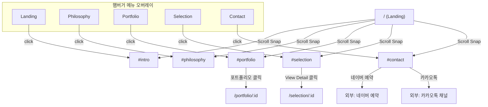

# Frontend Architecture v3.0 (Vue3 + Vite + TypeScript — High-end Editorial Magazine)

> **v3.0 핵심 변경:** 하이엔드 에디토리얼 매거진 스타일로 전면 전환.
> - 기존 VerticalSideNav **폐지** → HamburgerMenu + FullscreenOverlay 도입.
> - ScrollDrivenLogo 컴포넌트를 통한 스크롤 반응형 로고 애니메이션.
> - Vanilla CSS 기반 디자인 시스템 (Tailwind와 병행).

---

## 1. 구조 설계 원칙
- **상태 최적화:** Pinia — 권한(Auth), 장바구니(Cart), 메뉴 열림/닫힘(Menu) 전역 상태 관리.
- **HTTP 클라이언트 모듈화:** Axios Interceptor 기반 에러 일원화.
- **코드 스플리팅:** Vue Router 비동기 로드 + 컴포넌트 Lazy Loading.
- **Scroll-driven State:** `useActiveSection` Composable — Intersection Observer 기반 현재 活성 섹션 감지 + 스크롤 진행도 산출.

---

## 2. 디렉토리 구조

```text
/frontend
├── index.html              # OG / SEO 메타 태그
├── vite.config.ts          # Vite 설정
├── tailwind.config.js      # Design Token
├── src/
│   ├── main.ts             # App 엔트리
│   ├── router/
│   │   └── index.ts        # 라우트 정의
│   ├── store/              # Pinia Stores
│   │   ├── auth.ts
│   │   └── cart.ts
│   ├── services/           # API 클라이언트
│   │   ├── api.ts
│   │   ├── product.service.ts
│   │   └── auth.service.ts
│   ├── composables/
│   │   ├── useAuth.ts
│   │   ├── useToast.ts
│   │   ├── usePagination.ts
│   │   └── useActiveSection.ts  # 스크롤 스냅 섹션 감지
│   ├── views/
│   │   ├── HomeView.vue         # 원페이지 랜딩 (5 Sections)
│   │   ├── products/
│   │   └── admin/
│   ├── layouts/
│   │   ├── LandingLayout.vue    # 랜딩 전용 (HamburgerMenu 포함, 헤더 없음)
│   │   ├── DefaultLayout.vue    # 서비스 페이지용 (간소화 헤더 + Footer)
│   │   └── AdminLayout.vue
│   ├── components/
│   │   ├── common/              # BaseButton, BaseInput, ToastContainer
│   │   ├── domain/              # ProductCard, DynamicReservationForm
│   │   └── navigation/
│   │       ├── HamburgerMenu.vue         # [신규] 햄버거 + 풀스크린 오버레이
│   │       ├── ScrollSnapContainer.vue   # 스크롤 스냅 래퍼
│   │       └── FullScreenSection.vue     # 100vh 섹션 래퍼
│   ├── types/
│   │   └── api.d.ts
│   └── assets/
│       └── index.css            # 디자인 시스템 CSS
```

---

## 3. 라우팅 설계 (IA / Information Architecture)

### 3.1. 라우팅 구조

| 경로 | 레이아웃 | 페이지 / 설명 |
|------|----------|---------------|
| `/` | `LandingLayout` | 원페이지 랜딩 (5개 섹션 스크롤 스냅) |
| `/#intro` | — | Section 0: Landing (배경 비디오 + 로고 애니메이션) |
| `/#philosophy` | — | Section 1: Philosophy (오버래핑 에디토리얼) |
| `/#portfolio` | — | Section 2: Portfolio (비대칭 그리드) |
| `/#selection` | — | Section 3: Selection (공간 갤러리 최대 3장 및 위아래 스크롤 제품 리스트 전시) |
| `/#contact` | — | Section 4: Contact (미니멀 + 네이버예약/카카오톡) |
| `/products` | `DefaultLayout` | 상품 목록 (PLP) |
| `/products/:id` | `DefaultLayout` | 상품 상세 (PDP) |
| `/portfolio/:id` | `DefaultLayout` | 정적 포트폴리오 상세 (좌 고정 4섹션 정보, 우 가로 스크롤 사진) |
| `/selection/:id` | `DefaultLayout` | 오브제 상세 단일 타겟 조회(제품 확대 페이지) |
| `/cart` | `DefaultLayout` | 장바구니 |
| `/login` | `DefaultLayout` | 로그인 |
| `/register` | `DefaultLayout` | 회원가입 |
| `/mypage` | `DefaultLayout` | 마이페이지 |
| `/reservation` | `DefaultLayout` | 전체 예약 폼 |
| `/admin/*` | `AdminLayout` | 관리자 백오피스 |

### 3.2. 네비게이션 흐름도 (IA)



---

## 4. 핵심 기술 스펙 요약

### 4.1. 스크롤 스냅핑 구현
```css
.scroll-snap-container {
  height: 100vh;
  overflow-y: scroll;
  scroll-snap-type: y mandatory;
  scroll-behavior: smooth;
  -webkit-overflow-scrolling: touch;
}
.scroll-snap-container::-webkit-scrollbar { display: none; }
.scroll-snap-container { scrollbar-width: none; }

.full-screen-section {
  height: 100vh;
  scroll-snap-align: start;
  position: relative;
  overflow: hidden;
}
```

### 4.2. 스크롤 드리븐 로고 애니메이션
```typescript
// Section 0 내부에서 스크롤 진행도에 따른 로고 transform
const scrollProgress = computed(() => {
  // 0 = 최상단 (거대한 로고), 1 = Section 0 끝 (축소·이동)
  return Math.min(1, scrollTop / sectionHeight)
})

const logoStyle = computed(() => ({
  transform: `
    translate(
      ${lerp(0, -targetX, scrollProgress.value)}px,
      ${lerp(0, -targetY, scrollProgress.value)}px
    )
    scale(${lerp(1, 0.3, scrollProgress.value)})
  `,
}))
```

### 4.3. 햄버거 메뉴 오버레이
```typescript
const isMenuOpen = ref(false)
function toggleMenu() { isMenuOpen.value = !isMenuOpen.value }
function navigateToSection(id: string) {
  isMenuOpen.value = false
  nextTick(() => scrollToSection(id))
}
```

### 4.4. 활성 섹션 감지 (`useActiveSection.ts`)
기존 Intersection Observer 기반 Composable 유지. `scrollToSection()` 메서드 포함.

---

## 5. 보완 요소

- **표준 에러 처리:** Axios Interceptor → Toast Notification 일원화.
- **비회원 상태 유지:** localStorage Persistence.
- **랜딩 vs 서비스 페이지 분리:** LandingLayout(HamburgerMenu만), DefaultLayout(간소화 헤더+Footer).
